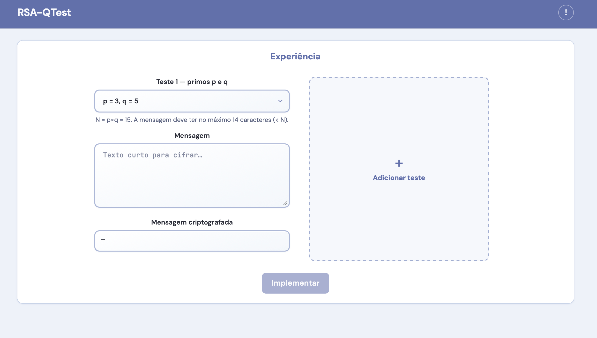
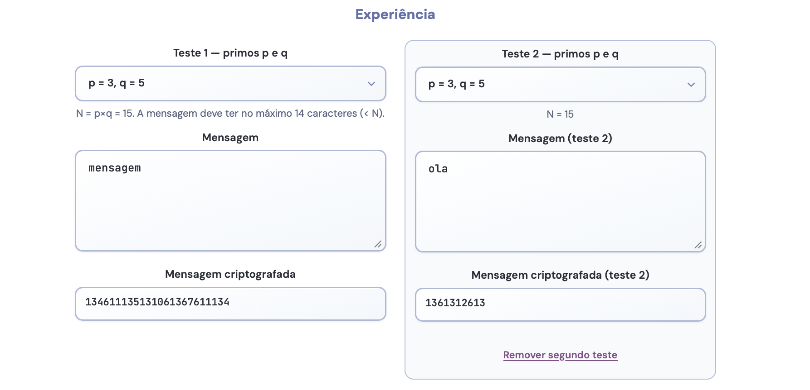
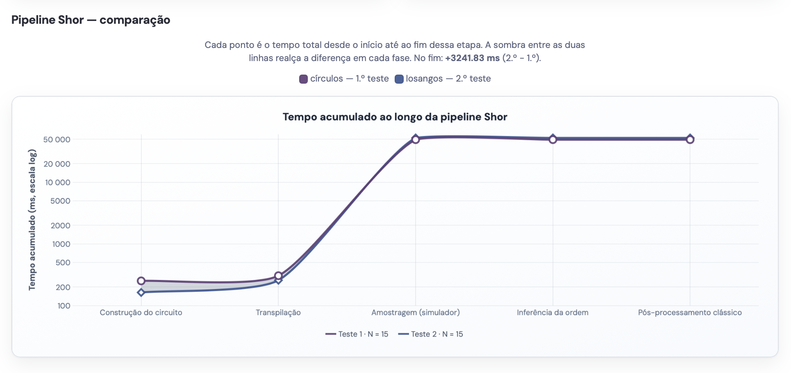
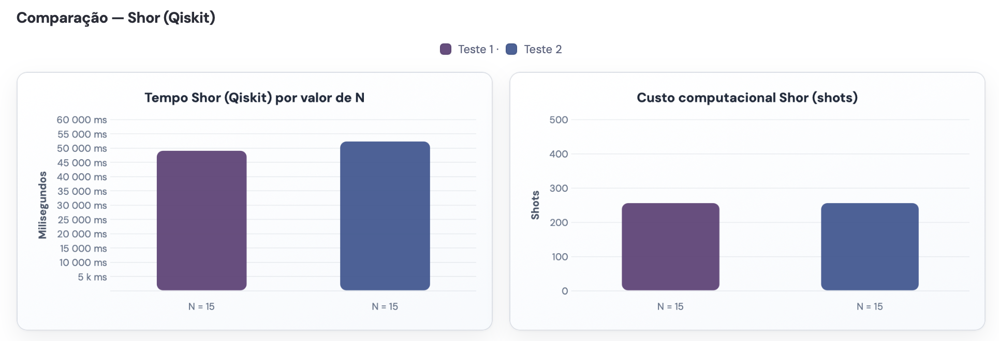
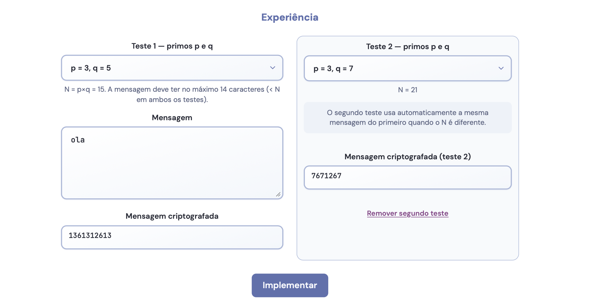
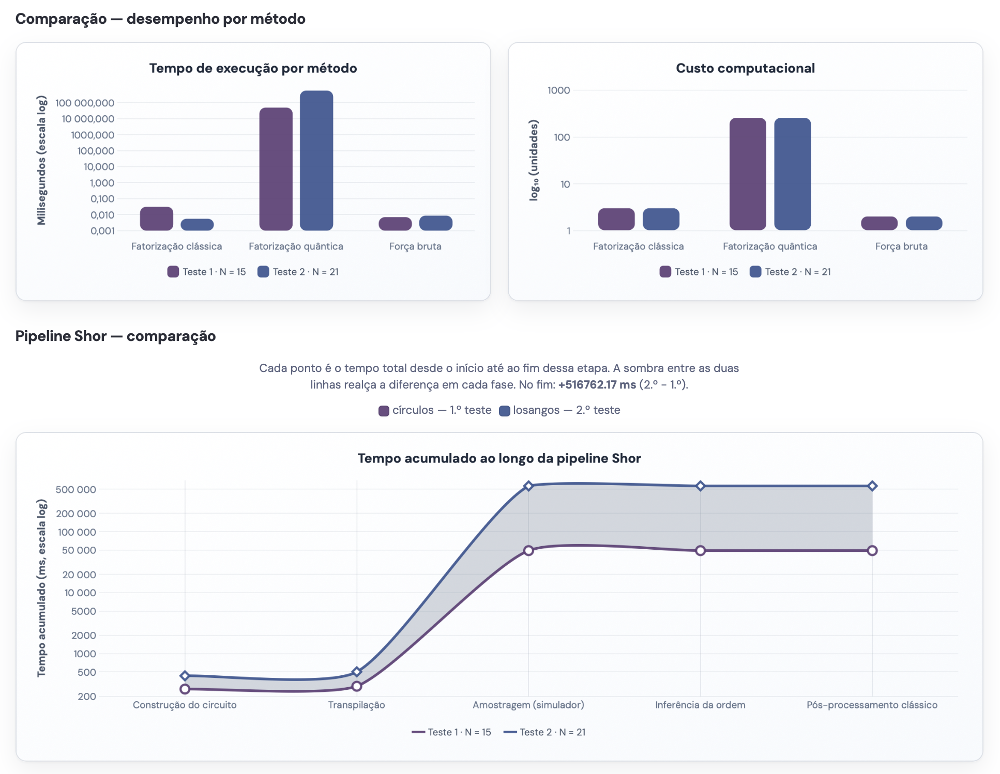
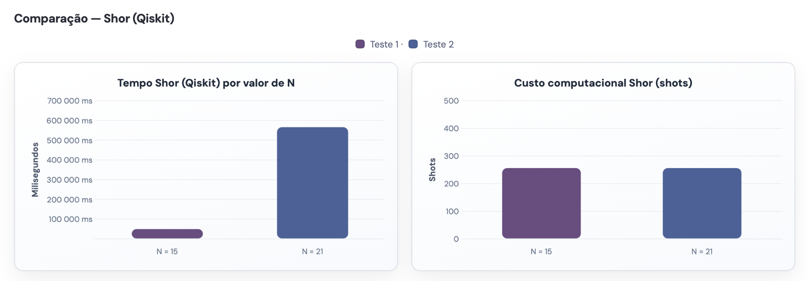
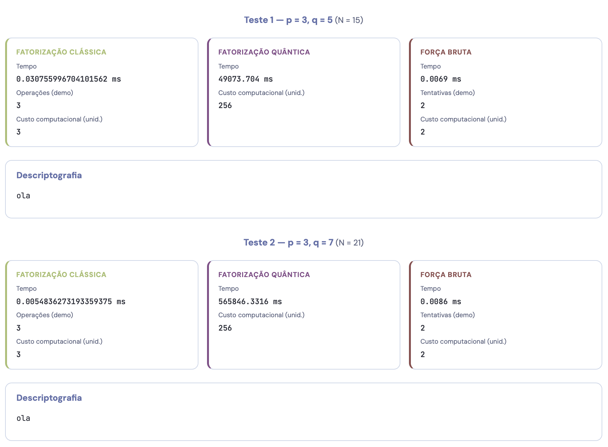
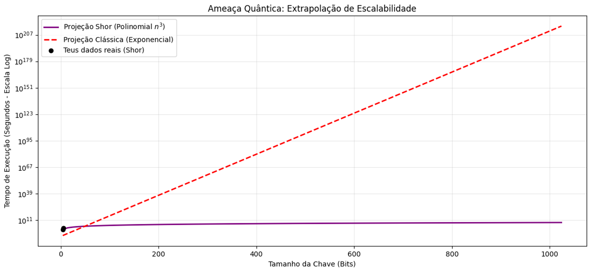
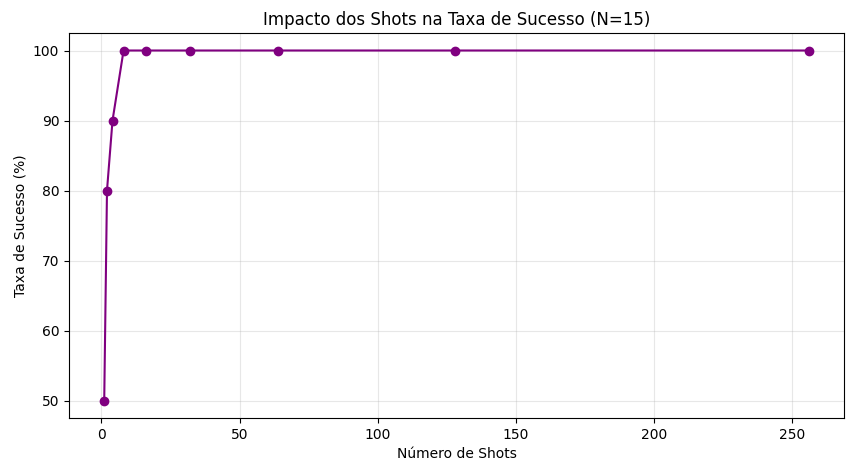

<div align="center">

# 🔐 RSA-QTest

**Comparative Analysis of Classical RSA vs Quantum Factorization (Shor's Algorithm)**

[](https://github.com/beatrizzfcosta/RSA-QTest/commits)
[](https://github.com/beatrizzfcosta/RSA-QTest)
[](https://github.com/beatrizzfcosta/RSA-QTest)
[](https://github.com/beatrizzfcosta/RSA-QTest/issues)
[](https://github.com/beatrizzfcosta/RSA-QTest/stargazers)

<br/>

**Built with the tools and technologies:**


</div>

---

## 📖 Overview

O **RSA-QTest** é uma aplicação experimental que analisa o impacto da computação quântica na criptografia clássica, com foco no algoritmo RSA.

A plataforma permite comparar:

* 🔐 Desempenho da cifragem e decifragem com RSA
* 🧮 Métodos clássicos de Fatorização
* ⚛️ Abordagem quântica com o algoritmo de Shor

O sistema demonstra, de forma prática e visual, como a segurança baseada na dificuldade computacional pode ser comprometida.

---

## 🏗️ Architecture

O sistema segue uma arquitetura em **3 camadas (three-tier)**:

```text
Frontend (React + Chart.js)
        ↓
Backend (FastAPI - Python)
        ↓
Quantum/Classical Processing (Qiskit + Algorithms)
```

---

## Estrutura do repositório

| Pasta | Descrição |
|-------|-----------|
| [`algorithms/`](algorithms/README.md) | RSA, Fatorização clássica, Shor (Qiskit) — lógica partilhada |
| [`backend/`](backend/README.md) | API FastAPI |
| [`frontend/`](frontend/README.md) | React, Chart.js |
| [`docs/`](docs/README.md) | Documentação 
| [`scripts/`](scripts/README.md) | Automação (setup, dev) |

Cada pasta inclui um **README** com tarefas de implementação e **comandos** sugeridos para executar localmente.


# Resultados e Análise Experimental

---

## 1. Interface Interativa e Overview
A solução apresenta uma interface interativa que permite configurar parâmetros RSA ($p$ e $q$) e mensagens personalizadas para testar a pipeline de criptoanálise.


*Figura 1: Interface principal do RSA-QTest.*

---

## 2. Teste de Impacto: Variação da Mensagem
Neste cenário, manteve-se o valor de **N fixo (N=15)**, variando apenas o conteúdo da mensagem para analisar a sensibilidade do algoritmo ao tamanho do input clássico.

### 2.1 Configuração do Teste

*Figura 2: Teste 1 - N constante com mensagens de comprimentos diferentes.*

### 2.2 Performance da Pipeline Quântica
A maior parte do tempo de execução concentra-se na etapa de **Amostragem (Simulador)**, onde reside a complexidade matemática da simulação quântica.


*Figura 3: Distribuição do tempo de execução na pipeline do algoritmo de Shor.*

### 2.3 Comparação de Custo Computacional
Observa-se que para o mesmo valor de N, o custo computacional em termos de simulação e *shots* mantém-se estável, validando que a complexidade reside na fatorização e não na mensagem cifrada.


*Figura 4: Tempo de execução Qiskit e custo em shots para N=15.*

---

## 3. Teste de Impacto: Tamanho da Chave ($N$)
De forma a avaliar a escalabilidade, comparou-se a fatorização de **N=15** ($4$ bits) contra **N=21** ($5$ bits).

### 3.1 Configuração da Experiência

*Figura 5: Teste 2 - Comparação entre chaves de diferentes dimensões.*

### 3.2 Análise de Desempenho por Método
O tempo de execução da simulação quântica sofre um aumento drástico com o aumento de $N$, evidenciando a dificuldade de simular qubits adicionais em hardware clássico.


*Figura 6: Diferencial de tempo entre N=15 e N=21 (detalhe da fase de Amostragem).*

### 3.3 Métricas Detalhadas Qiskit
Comparação direta do tempo acumulado necessário para o simulador processar diferentes profundidades de circuito.


*Figura 7: Performance comparativa do simulador Qiskit.*

### 3.4 Validação e Resumo de Resultados
Verificação final da decifragem bem-sucedida comparando os três métodos: Fatorização Clássica, Shor e Força Bruta.


*Figura 8: Validação da decifragem e resumo das métricas experimentais.*

---

## 4. Análise de Escalabilidade e Limitações Quânticas

### 4.1 Extrapolação da Ameaça Quântica
Comparação entre a fatorização clássica (exponencial) e o algoritmo de Shor (polinomial) para chaves RSA de dimensão real.


*Figura 9: Projeção de escalabilidade: Shor (Polinomial) vs Clássico (Exponencial).*

**Análise:** A vantagem quântica torna-se evidente em chaves maiores. Enquanto o método clássico se torna computacionalmente inviável para 1024 bits, o algoritmo de Shor mantém uma curva de crescimento polinomial, demonstrando a vulnerabilidade do RSA a longo prazo.

### 4.2 Taxa de Sucesso (Natureza Probabilística)
O algoritmo de Shor depende da amostragem estatística para identificar o período $r$ correto.


*Figura 10: Impacto do número de Shots na Taxa de Sucesso (N=15).*

**Análise:** O sistema atinge estabilidade total (100% de sucesso) a partir dos **32 shots**. Valores inferiores resultam em incerteza estatística, onde a resposta correta não é distinguível do ruído.

---